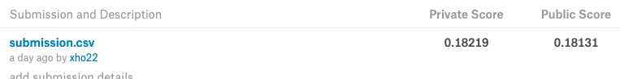

# Udacity Quora句子相似度匹配毕业项目
## 数据集
训练数据和测试数据下载:

- https://www.kaggle.com/c/quora-question-pairs/download/train.csv
- https://www.kaggle.com/c/quora-question-pairs/download/test.csv

语料库下载地址，下载完解压

- http://nlp.stanford.edu/data/glove.840B.300d.zip

## 使用到的库
- numpy
- pandas
- sklearn
- tensorflow
- Keras

## 训练所用机器
- CPU:      Intel(R) Core(TM) i7-7700 CPU @ 3.60GHz 8核
- Memory:   32G
- GPU:      GTX 1060

## 操作系统
Ubuntu 16.04 LTS 64位

## 运行时间
### 特征提取时间
- Word Embedding  20分钟

### 训练时间
- LSTM       150秒/Epoch * 20左右 Epochs 共50分钟

## 运行方式
	pip3 install -r requirements.txt
	unzip glove.840B.300d.zip
	python3 -u process.py

## 结果
